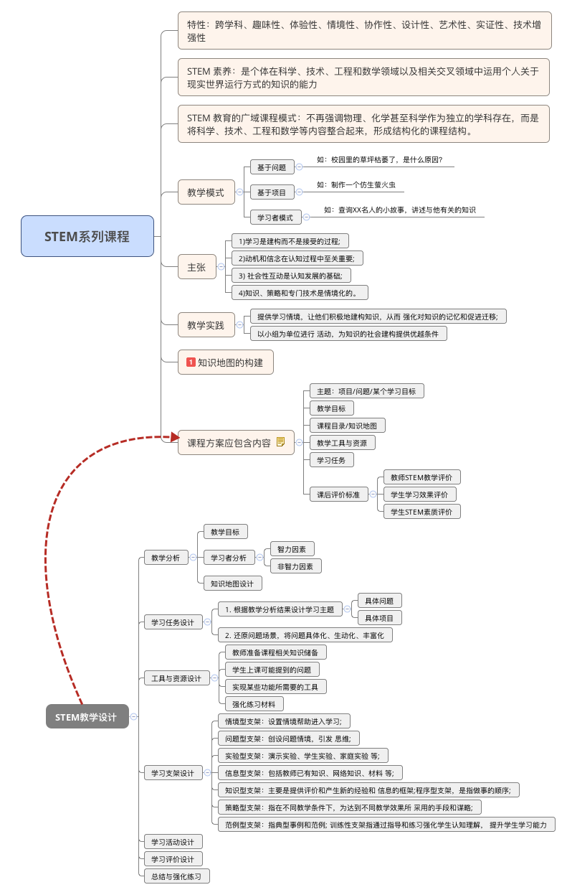

# README

## GITBOOK

InputStream is = MainActivity.this.getAssets\(\).open\("\_city.json"\); MainActivity.this.getResources\(\).openRawResource\(R.raw.weather2\); Reader reader=new InputStreamReader\(is\); StringBuffer stringBuffer=new StringBuffer\(\); byte\[\] bytes=new byte\[is.available\(\)\]; / _int len =-1; while\(\(len=is.read\(bytes\)\)!=-1\) { stringBuffer.append\(new String\(bytes,0,len\)\); }_/ is.read\(bytes\);

```text
                JSONArray jsonArray=new JSONArray(new String(bytes));
                for(int i=0;i<jsonArray.length();i++)
                {
                    JSONObject jsonObject= (JSONObject) jsonArray.opt(i);
                    stringBuffer.append(jsonObject.optString("city_name")+jsonObject.optString("city_code")+jsonObject.optString("id")+"\n");

                }
                Log.e("Mainactivity",stringBuffer.toString());
            } catch (IOException e) {
                e.printStackTrace();
            } catch (JSONException e) {
                e.printStackTrace();
            }
```

## [buxhifs](xiaomi.md)

\#2019年5月8日 今天去爱义行洗车了，担心原来办的卡不能用了，感觉这次比原来洗的_干净_

！

## _---_



\#\#搞了一下午bitbook还是有问题，据说是改版的问题！

